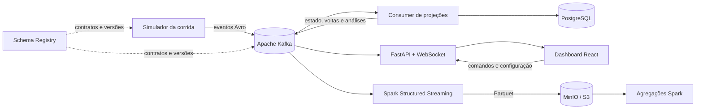

# 🏁 RaceStream Lab

**Uma corrida de automóveis como laboratório de sistemas distribuídos.** Vinte
carros simulados geram telemetria, publicam eventos no Kafka e alimentam uma
classificação ao vivo, análises e um histórico consultável. O projeto reúne
simulação, engenharia de dados e visualização em uma stack que pode ser executada
localmente com Docker Compose.

> Acompanhe cada volta, parada e ultrapassagem enquanto os dados percorrem o
> pipeline — do movimento do carro até o mapa e os indicadores da corrida.

**Python · Apache Kafka · Avro · PostgreSQL · Spark · MinIO · FastAPI · React · TypeScript**

<a id="indice"></a>
## 🧭 Navegação

1. [Visão geral](#visao-geral)
   1. [O problema](#o-problema)
   2. [O que o projeto entrega](#o-que-o-projeto-entrega)
2. [Arquitetura](#arquitetura)
3. [Tecnologias e motivos de escolha](#tecnologias)
4. [O que você pode explorar](#funcionalidades)
5. [Executar localmente](#executar)
6. [Acessos e ferramentas](#acessos)
7. [Tópicos Kafka](#topicos)
8. [Dados e persistência](#dados)
9. [Testes e validação](#validacao)
10. [Organização do projeto](#organizacao)
11. [Limites e próximos passos](#roadmap)
12. [Documentação](#documentacao)

<a id="visao-geral"></a>
## 1.0 🏎️ Visão geral

O RaceStream Lab transforma uma corrida simulada em um fluxo contínuo de dados.
Cada carro mantém seu próprio estado e publica telemetria e eventos de corrida.
Os serviços processam essas mensagens sem depender diretamente uns dos outros,
enquanto o dashboard atualiza a pista, o pelotão e as análises.

<a id="o-problema"></a>
### 1.1 O problema

Sistemas de dados em tempo real precisam lidar com eventos frequentes, múltiplas
fontes, ordenação, contratos que evoluem e consumidores com necessidades
diferentes. Uma demonstração estática esconde essas dificuldades: não mostra o
que acontece quando um carro entra nos boxes, perde posições, conclui uma volta
ou publica dados que precisam ser interpretados por mais de um serviço.

Este projeto usa uma corrida para tornar esses desafios visíveis e reproduzíveis.
O cenário é divertido de acompanhar, mas também permite estudar particionamento,
serialização, processamento de streams, persistência, replay e apresentação ao
vivo.

<a id="o-que-o-projeto-entrega"></a>
### 1.2 O que o projeto entrega

- Uma prova com **20 carros**, equipes e pilotos identificados.
- Simulação física com velocidade, aceleração, frenagem, distância, combustível,
  pneus, posição e tempos medidos na pista.
- Eventos Kafka separados por finalidade, com schemas Avro registrados e
  versionados.
- Classificação ao vivo, mapa interativo, acompanhamento por carro/piloto/equipe
  e histórico de voltas e parciais.
- Configuração de chuva e incidentes antes da largada; condições da pista afetam
  o ritmo e as estratégias de pneus e combustível.
- PostgreSQL para estado operacional e MinIO para histórico analítico em Parquet,
  com processamento Spark.

<a id="arquitetura"></a>
## 2.0 🧱 Arquitetura



O Kafka desacopla o simulador, os consumidores e as interfaces. Os contratos
Avro definem a estrutura dos eventos; o Schema Registry mantém as versões. O
consumer cria projeções operacionais e analíticas, que podem ser consultadas pelo
dashboard em tempo real. Em paralelo, Spark arquiva os envelopes originais no
MinIO para análise posterior.

<a id="tecnologias"></a>
## 3.0 🛠️ Tecnologias e motivos de escolha

| Tecnologia | Como é usada | Por que foi escolhida |
| --- | --- | --- |
| **Python 3.12+** | Simulador, regras de domínio, producer, consumer e API. | Ecossistema adequado para prototipar e testar regras de corrida e integrações de dados. |
| **Apache Kafka** | Barramento de eventos da corrida. | Separa produtores de consumidores, preserva eventos e permite que vários serviços acompanhem o mesmo fluxo. |
| **Avro + Schema Registry** | Serialização dos eventos e gestão de schemas. | Contratos compactos e versionados ajudam produtores e consumidores a evoluir com compatibilidade explícita. |
| **PostgreSQL** | Configuração, controle, resultados e projeções operacionais. | Transações e integridade relacional para os dados que definem e controlam cada sessão. |
| **Apache Spark Structured Streaming** | Arquivamento contínuo de tópicos; jobs em lote para desempenho e paridade analítica. | Permite demonstrar ingestão e análise sobre os mesmos eventos, com processamento escalável. |
| **MinIO** | Armazenamento local compatível com S3 para Parquet e checkpoints. | Reproduz um padrão comum de object storage sem depender de conta ou serviço em nuvem. |
| **FastAPI + WebSocket** | API de controle e distribuição de atualizações ao painel. | Endpoints HTTP claros para configuração e comandos, com canal persistente para atualizações ao vivo. |
| **React + TypeScript + SVG** | Dashboard e mapa da pista. | Componentes reutilizáveis, tipos explícitos e desenho vetorial atualizável com os dados. |
| **Redpanda Console** | Inspeção visual do Kafka local. | Facilita consultar tópicos, mensagens, grupos de consumidores e schemas durante o desenvolvimento. |
| **Docker Compose** | Execução integrada dos serviços locais. | Torna a stack reproduzível sem exigir cluster ou infraestrutura em nuvem. |

### 3.1 Tecnologias previstas para outras etapas

O projeto mantém espaço para evoluir os contratos para Protobuf, comparar Spark
com Flink e adicionar ClickHouse, Iceberg, Debezium, Kubernetes e observabilidade
com OpenTelemetry, Prometheus e Grafana. **Esses componentes ainda não fazem
parte do fluxo executado atualmente.** A arquitetura deve permitir avaliá-los em
incrementos sem tornar o domínio da corrida dependente de um motor específico.

<a id="funcionalidades"></a>
## 4.0 🎮 O que você pode explorar

### 4.1 Corrida e estratégia

- Inicie e pare a prova pelos controles do painel.
- Configure chuva, volta de início e intensidade; a chuva altera aderência e
  velocidade e programa trocas escalonadas para pneus de chuva.
- Programe furos e colisões reproduzíveis para carros e voltas específicos.
- Compare estratégias de combustível e pneus, incluindo o tempo perdido nos
  boxes e o limite de **60 km/h** entre a entrada e a saída do pit lane.

### 4.2 Acompanhamento ao vivo

- Veja cada carro avançar na pista e consulte sua identificação e posição.
- Acompanhe o pelotão ordenado por posição, com bandeira, piloto, equipe,
  progresso da prova e tempo da última volta.
- Selecione carro, piloto ou equipe e explore tempos de volta, parciais e
  indicadores recebidos durante a corrida.
- Consulte velocidade, marcha, RPM, pneus, combustível e força G simulada.

O mapa e os cálculos representam um **modelo de simulação**. A pista, seus raios
e os pontos de cronometragem são aproximações; a força G não é uma medição feita
no corpo de um piloto real.

<a id="executar"></a>
## 5.0 🚀 Executar localmente

### 5.1 Pré-requisitos

- Docker Engine e Docker Compose v2.
- Git para clonar o repositório.
- Para os testes locais: Python 3.12 ou superior e Node.js/npm.

### 5.2 Iniciar a stack

Na raiz do repositório, execute:

```bash
docker compose up --build -d
```

O primeiro início pode levar mais tempo: a imagem local do MinIO é compilada
durante o build, e o Spark baixa seus conectores. Para acompanhar a inicialização:

```bash
docker compose ps
docker compose logs -f simulator consumer spark-archive
```

Abra o dashboard e use **Iniciar corrida**. A prova padrão tem 60 voltas; o
simulador avança a física em passos curtos e reproduz o relógio 45 vezes mais
rápido que o tempo real. Cada carro publica um snapshot de telemetria por segundo
real, além dos eventos de cronometragem. O encerramento depende da chegada dos
carros, não de um cronômetro fixo de parede.

O painel foi projetado para desktop e requer largura mínima aproximada de
1.100 px. Antes da largada, configure os cenários disponíveis. Para o grid padrão
de 20 carros e 60 voltas, a chuva deve começar até a volta 21 para permitir as
paradas escalonadas previstas.

<a id="acessos"></a>
## 6.0 🔗 Acessos e ferramentas

Abra os endereços na máquina onde o Compose está em execução.

| Serviço | Acesso | Uso |
| --- | --- | --- |
| Dashboard | [localhost:5173](http://localhost:5173) | Configurar, iniciar e acompanhar a corrida. |
| Redpanda Console | [localhost:8080](http://localhost:8080) | Explorar Kafka, tópicos, mensagens e schemas. |
| API OpenAPI | [localhost:8000/docs](http://localhost:8000/docs) | Consultar e testar os endpoints HTTP. |
| Schema Registry | [localhost:8081/subjects](http://localhost:8081/subjects) | Ver os schemas registrados. |
| Console MinIO | [localhost:19001](http://localhost:19001) | Inspecionar o bucket e os objetos analíticos. |
| MinIO S3 | `localhost:19000` | Endpoint S3 local para clientes e ferramentas. |
| Kafka para clientes locais | `localhost:9092` | Broker para aplicações executadas no host. |

Credenciais locais padrão do MinIO: `racestream` / `racestream-local-only`.
Configure `MINIO_ROOT_USER` e `MINIO_ROOT_PASSWORD` no ambiente local para
substituí-las.

<a id="topicos"></a>
## 7.0 📬 Tópicos Kafka

Os tópicos curtos deixam clara a finalidade dos eventos. A versão permanece no
schema e no payload. Clique em um nome para abrir suas mensagens no Console.

| Tópico | Finalidade | Chave Kafka |
| --- | --- | --- |
| [`telemetry`](http://localhost:8080/topics/telemetry) | Snapshots de velocidade, posição, combustível, pneus e força G. | `car_id` |
| [`validated`](http://localhost:8080/topics/validated) | Telemetria que passou pela validação. | `car_id` |
| [`timing`](http://localhost:8080/topics/timing) | Passagens por checkpoints, setores e linha de chegada. | `car_id` |
| [`lap_completed`](http://localhost:8080/topics/lap_completed) | Voltas concluídas, setores e validade da medição. | `car_id` |
| [`pitstop`](http://localhost:8080/topics/pitstop) | Entrada, serviço e saída dos boxes. | `car_id` |
| [`incident`](http://localhost:8080/topics/incident) | Incidentes e motivo associado ao carro. | `car_id` |
| [`control`](http://localhost:8080/topics/control) | Início, parada, encerramento e configuração congelada da prova. | `race_id` |
| [`state`](http://localhost:8080/topics/state) | Quadros de estado e classificação dos carros. | `race_id` |
| [`analytics`](http://localhost:8080/topics/analytics) | Agregados de voltas, ritmo e parciais. | `race_id` |
| [`dead_letter`](http://localhost:8080/topics/dead_letter) | Eventos recusados e referência à mensagem de origem. | Chave original |

No Compose local, cada tópico tem seis partições, uma réplica e retenção de sete
dias. Eventos de carro usam `car_id` para preservar ordenação por veículo;
quadros agregados usam `race_id`. Tópicos com nomes anteriores permanecem no
broker para consulta histórica, mas os serviços atuais publicam nos nomes desta
lista.

<a id="dados"></a>
## 8.0 🗃️ Dados e persistência

| Armazenamento | Responsabilidade no projeto |
| --- | --- |
| **Kafka** | Transporte e retenção temporária dos eventos da corrida. |
| **PostgreSQL** | Configurações, controle da prova, resultados e projeções operacionais. |
| **MinIO / Parquet** | Arquivo dos envelopes Kafka originais e dos agregados analíticos. |

O arquivador Spark grava os eventos em `s3a://racestream/telemetry_raw/`,
particionados por tópico e data. O checkpoint corrente fica em
`s3a://racestream/_checkpoints/spark_kafka_archive_v2/`. Um job em lote grava
`lap_performance/` e `consumer_parity/`, comparando voltas válidas e tempos
calculados pelo Spark com as análises do consumer.

Consulte o [dicionário de dados](docs/dicionario-de-dados.md) para os campos,
schemas Avro, finalidade e chave de cada tópico. As migrações SQL em
`postgres/initdb/` documentam a estrutura relacional. O Kafka é o barramento do
fluxo, não o armazenamento analítico permanente.

<a id="validacao"></a>
## 9.0 ✅ Testes e validação

Prepare o ambiente Python de desenvolvimento:

```bash
python3 -m venv .venv
.venv/bin/pip install -e '.[dev]'
```

Execute os testes e verificações:

```bash
.venv/bin/ruff check src tests
.venv/bin/pytest
.venv/bin/mypy src
npm --prefix frontend ci
npm --prefix frontend test
npm --prefix frontend run build
docker compose config --quiet
```

Os testes de integração com Kafka exigem os serviços ativos:

```bash
RUN_KAFKA_INTEGRATION=1 .venv/bin/pytest tests/integration -q
```

<a id="organizacao"></a>
## 10.0 🗂️ Organização do projeto

```text
src/racestream/                 domínio, aplicação, adapters e API Python
frontend/                       dashboard React, TypeScript e SVG
schemas/                        contratos Avro versionados
stream-processing/spark/        arquivador e análises em Spark
postgres/initdb/                schema e migrações PostgreSQL
config/                         configuração versionada da pista
docs/                           decisões, planos, validações e retomada
docker-compose.yml              serviços locais da plataforma
```

<a id="roadmap"></a>
## 11.0 🧭 Limites e próximos passos

Já estão operacionais a simulação, publicação Kafka/Avro, projeções online,
dashboard com WebSocket, PostgreSQL e arquivamento/análise com Spark e MinIO.
Flink, Iceberg, ClickHouse, CDC com Debezium, Kubernetes e observabilidade
completa continuam como possibilidades de evolução, não como requisitos para
executar a versão local atual.

A corrida serve para aprendizado e demonstração técnica. O traçado e os modelos
de física, desgaste, clima, combustível e força G são simplificações do
laboratório e não devem ser interpretados como telemetria ou regulamento de uma
competição real.

<a id="documentacao"></a>
## 12.0 📚 Documentação

- [Registro de retomada e estado atual](docs/RETOMADA.md)
- [Plano de refinamento da corrida](docs/execplan-refinamento-corrida.md)
- [Cenários interativos e paridade Spark](docs/execplan-corrida-interativa.md)
- [Plano de Spark, PostgreSQL e MinIO](docs/execplan-spark-postgresql-minio.md)
- [Regras propostas da corrida](docs/planejamento/regras-corrida-v2.md)
- [Dicionário de dados](docs/dicionario-de-dados.md)
- [Decisões arquiteturais (ADRs)](docs/adr/)
- [Atribuição do desenho da pista](frontend/public/ATTRIBUTION.md)

### 12.1 Parar a stack e preservar os dados

Para parar os serviços e manter os volumes:

```bash
docker compose down
```

`docker compose down -v` também remove os volumes de Kafka, PostgreSQL e MinIO e
apaga os dados locais. Use esse comando apenas quando quiser reiniciar o ambiente
do zero.
