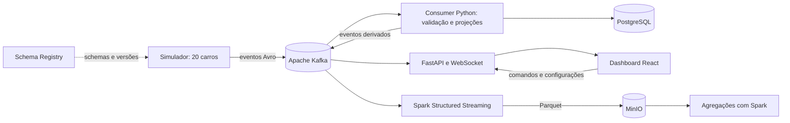

# 🏁 RaceStream Lab

**Uma corrida de automóveis transformada em um laboratório de dados em tempo
real.** Vinte carros percorrem uma pista simulada, publicam eventos no Kafka e
alimentam uma classificação ao vivo, análises de voltas e um histórico em
Parquet. O projeto conecta engenharia de software, sistemas distribuídos e uma
corrida que dá vontade de acompanhar até a bandeirada.

> Acompanhe o caminho de cada evento: do carro em movimento ao Kafka, do
> processamento à persistência e, por fim, ao mapa e aos indicadores da corrida.

**Python · Apache Kafka · Avro · PostgreSQL · Apache Spark · MinIO · FastAPI · React · TypeScript**

## 🧭 Menu

1. [Objetivo](#objetivo)
   - [1.1 Problema que o projeto aborda](#problema-do-projeto)
2. [Princípios da arquitetura](#principios-da-arquitetura)
   - [2.1 Ferramentas e motivos de escolha](#ferramentas-e-motivos)
3. [Executar corrida](#executar-corrida)
   - [3.1 Iniciar serviços e corrida](#iniciar-servicos)
   - [3.2 Finalizar a corrida](#finalizar-a-corrida)
   - [3.3 Telemetria](#telemetria)
4. [Resultados](#resultados)
5. [Como analisar](#como-analisar)
6. [Simulação: como acontece a corrida](#simulacao)
   - [6.1 Como configurar](#como-configurar)
7. [O que está implementado](#estado-da-implementacao)
8. [Testes e desenvolvimento](#testes)
9. [Organização do projeto](#organizacao)
10. [Documentação](#documentacao)

<a id="objetivo"></a>
## 1. Objetivo 🎯

O RaceStream Lab demonstra como projetar uma plataforma orientada a eventos em
que vários serviços produzem, validam, processam e apresentam dados contínuos.
Uma corrida torna esses conceitos observáveis: cada carro tem estado próprio,
os eventos têm ordem e contratos, e mudanças na pista alteram o que acontece
com os veículos.

O projeto **não está totalmente implementado em relação a todas as tecnologias
que já foram cogitadas**. A simulação, o fluxo Kafka, o painel, PostgreSQL,
Spark e MinIO funcionam nesta stack local. Alguns componentes da visão futura,
como ClickHouse e Grafana, ainda não foram desenvolvidos. A situação completa
está na seção [O que está implementado](#estado-da-implementacao).

<a id="problema-do-projeto"></a>
### 1.1 Problema que o projeto aborda

Em um sistema distribuído, o mesmo fato pode alimentar consumidores diferentes,
chegar fora de ordem ou precisar ser relido após uma falha. Uma tela com dados
estáticos não permite observar esses desafios. A corrida fornece eventos
frequentes, entidades independentes e situações fáceis de entender — como uma
parada nos boxes que altera o tempo e a posição do carro — para estudar e validar
o fluxo de dados de ponta a ponta.

<a id="principios-da-arquitetura"></a>
## 2. Princípios da arquitetura 🧱

- **Eventos desacoplam os serviços:** o simulador publica no Kafka; consumers,
  API e arquivador Spark leem os tópicos conforme sua responsabilidade.
- **Contratos explícitos:** Avro define o formato dos eventos e o Schema Registry
  guarda as versões e aplica compatibilidade.
- **Spark é o único motor de processamento distribuído adotado pelo projeto.**
  Structured Streaming arquiva o fluxo Kafka; Spark também executa análises em
  lote. O consumer Python segue responsável pelas projeções da corrida ao vivo.
- **Cada dado tem um destino adequado:** PostgreSQL guarda estado operacional e
  resultados; MinIO guarda arquivos Parquet; Kafka transporta eventos com
  retenção temporária.
- **A stack pode ser reproduzida localmente:** Docker Compose sobe os serviços
  sem exigir uma conta de nuvem.



<a id="ferramentas-e-motivos"></a>
### 2.1 Ferramentas e motivos de escolha

| Ferramenta | Papel atual | Motivo da escolha |
| --- | --- | --- |
| **Python** | Simulador, regras, consumer e API. | Facilita implementar e testar as regras da corrida com um ecossistema amplo para dados. |
| **Apache Kafka** | Transporte dos eventos por tópico. | Desacopla quem produz telemetria de quem apresenta, processa ou arquiva os eventos. |
| **Avro + Schema Registry** | Serialização e versionamento dos contratos. | Permitem validar a estrutura das mensagens e evoluir schemas com compatibilidade explícita. |
| **PostgreSQL** | Configurações, estado operacional, sessões e resultados. | Oferece transações e integridade para dados que precisam ser atualizados de forma consistente. |
| **Apache Spark** | Arquivamento contínuo e agregações batch. | Processa os fluxos arquivados e permite comparar análises com o consumer online. |
| **MinIO** | Objetos Parquet e checkpoints do Spark. | Fornece armazenamento compatível com S3 que pode ser executado localmente. |
| **FastAPI + WebSocket** | API de controle e atualizações ao dashboard. | Combina comandos HTTP com comunicação persistente para acompanhar a corrida. |
| **React + TypeScript + SVG** | Interface e mapa da pista. | Permite atualizar visualmente os carros e seus dados com uma interface tipada. |
| **Docker Compose** | Execução da stack local. | Sobe os componentes em conjunto sem depender de cluster ou conta em nuvem. |

O Spark não substitui o consumer Python no processamento ao vivo da corrida.
Ele arquiva envelopes Kafka em Parquet e calcula agregados em lote quando o job
analítico é executado.

<a id="executar-corrida"></a>
## 3. Executar corrida 🏎️

<a id="iniciar-servicos"></a>
### 3.1 Iniciar serviços e corrida

**Pré-requisito:** Docker com Docker Compose v2.

Na raiz do repositório, inicie a stack:

```bash
docker compose up --build -d
docker compose ps
```

O Compose inicia PostgreSQL, Kafka, Schema Registry, Redpanda Console, MinIO,
Spark, API, dashboard, simulador e consumer. O primeiro build pode demorar mais
porque compila a imagem local do MinIO e baixa os conectores do Spark.

Abra o dashboard local servido na porta **5173**. Configure a prova, se desejar,
e clique em **Iniciar corrida**. A configuração padrão tem 20 carros e 60 voltas.
O relógio é acelerado por padrão para deixar a prova mais rápida de acompanhar.

Confira o estado dos serviços e acompanhe os logs quando necessário:

```bash
docker compose ps
docker compose logs -f simulator consumer spark-archive
```

<a id="finalizar-a-corrida"></a>
### 3.2 Finalizar a corrida

Para encerrar a prova pelo dashboard, clique em **Parar corrida**. O sistema
registra a classificação parcial e mantém a corrida no histórico. Corridas
concluídas normalmente encerram quando os carros cruzam a linha de chegada.

Para parar os serviços depois da corrida:

```bash
docker compose down
```

Esse comando mantém os volumes de Kafka, PostgreSQL e MinIO. O comando
`docker compose down -v` apaga esses dados e deve ser usado somente para remover
o ambiente local por completo.

<a id="telemetria"></a>
### 3.3 Telemetria

O simulador integra a física em passos curtos e publica aproximadamente um
snapshot por segundo real para cada carro. Cada mensagem inclui dados como
velocidade, posição normalizada na pista, volta, setor, combustível, pneus e
aceleração G simulada. Passagens por checkpoints, voltas, paradas e incidentes
são eventos próprios.

Os tópicos Kafka atuais separam esses tipos de informação:

| Tópico | Informação publicada |
| --- | --- |
| `telemetry` | Telemetria bruta dos carros. |
| `validated` | Telemetria que passou pela validação do consumer. |
| `timing` | Passagens por checkpoints, setores e chegada. |
| `lap_completed` | Voltas concluídas e seus tempos. |
| `pitstop` | Entrada, serviço e saída dos boxes. |
| `incident` | Incidentes e motivos. |
| `control` | Eventos de controle e configuração congelada da prova. |
| `state` | Quadros de estado e classificação. |
| `analytics` | Agregados de voltas e parciais. |
| `dead_letter` | Mensagens recusadas e referência à origem. |

O pelotão mostra a posição e o progresso da prova, além do tempo da última volta.
O dashboard recebe os quadros e as análises pelo WebSocket. Os schemas, campos,
tipos e chaves de cada tópico estão descritos em `docs/dicionario-de-dados.md`.

<a id="resultados"></a>
## 4. Resultados 🏆

Durante a prova, o dashboard apresenta a ordem dos carros, a volta atual, o tempo
da última volta e as métricas do carro, piloto ou equipe selecionados. Ao parar
ou concluir a corrida, a sessão e os resultados por carro permanecem registrados
no PostgreSQL para consulta posterior pela aplicação.

As principais tabelas operacionais incluem:

| Tabela | Conteúdo |
| --- | --- |
| `races` | Identificação, configuração básica e estado da corrida. |
| `race_results` | Posição final/parcial, voltas e configuração por carro. |
| `stream_sessions` | Projeção recuperável, quadro de estado e análise atual. |
| `stream_events` | Histórico cronometrado de voltas e passagens. |
| `stream_receipts` e `stream_outbox` | Controle de eventos processados e publicações pendentes. |

Os eventos brutos de alta frequência são arquivados pelo Spark no MinIO; não
tratamos Kafka como banco histórico permanente.

<a id="como-analisar"></a>
## 5. Como analisar 📊

O serviço `spark-archive` lê os tópicos Kafka com Spark Structured Streaming e
grava envelopes Avro originais em Parquet no bucket local `racestream`, em
`telemetry_raw/`. Os offsets e o checkpoint ficam no MinIO para permitir a
retomada do arquivamento.

Para calcular desempenho por carro e comparar os agregados Spark com o consumer,
execute o job em lote `agregar_voltas.py`. Ele grava `lap_performance/` e
`consumer_parity/` no mesmo bucket. A comparação verifica quantidade de voltas,
melhor volta e pior volta. Na validação registrada em 06/10/2026, os 80 pares
corrida/carro comparados coincidiram.

Para reduzir a concorrência por memória, pause o arquivador enquanto executa o
job. Depois, reinicie-o mesmo se a análise terminar com erro:

```bash
docker compose stop spark-archive
docker compose run --rm --no-deps spark-archive \
  --master 'local[1]' --driver-memory 512m \
  --conf spark.jars.ivy=/opt/spark/work-dir/.ivy2 \
  --packages org.apache.spark:spark-avro_2.13:4.0.1,org.apache.hadoop:hadoop-aws:3.4.1 \
  /opt/racestream/agregar_voltas.py
docker compose up -d spark-archive
```

O programa imprime as contagens de pares comparados, coincidentes e divergentes.
Os schemas writer de cada evento são obtidos do Schema Registry pelo ID Avro
guardado no envelope.

<a id="simulacao"></a>
## 6. Simulação: como acontece a corrida 🔬

1. A API lê do PostgreSQL as configurações de pista, carros e cenário.
2. O worker cria uma sessão com estados independentes para os 20 carros.
3. O simulador atualiza velocidade, aceleração, combustível, pneus, distância e
   progresso; os cruzamentos são usados para cronometrar parciais e voltas.
4. O producer serializa os eventos em Avro e os publica nos tópicos Kafka com
   chave por carro quando a ordem individual é necessária.
5. O consumer valida os eventos, monta projeções da corrida e publica quadros de
   estado e análises. PostgreSQL mantém esses dados operacionais.
6. FastAPI distribui atualizações ao dashboard por WebSocket, e o mapa posiciona
   os carros de acordo com o progresso normalizado da pista.
7. Em paralelo, Spark arquiva os eventos brutos no MinIO para análise posterior.

As paradas consideram o tempo de serviço e o trecho de boxes respeita o limite
simulado de **60 km/h** da entrada à saída. A chuva altera o ritmo e provoca
trocas escalonadas para pneus de chuva. Furos e colisões programados produzem
eventos reproduzíveis a partir da configuração da sessão.

<a id="como-configurar"></a>
### 6.1 Como configurar

Antes da largada, o dashboard permite ajustar os parâmetros da corrida e dos
carros. As opções incluem distância da prova, velocidade máxima, massa,
composto, equipe, piloto e estratégia de combustível/pneus.

Também é possível configurar:

- **Chuva:** ativação, volta de início e intensidade. No grid padrão de 20 carros
  e 60 voltas, a chuva deve começar até a volta 21 para permitir as paradas
  individuais escalonadas em intervalos de 2 a 6 voltas.
- **Furo de pneu:** carro e volta do incidente; o carro agenda parada para a
  troca necessária.
- **Colisão:** carros envolvidos e volta; o cenário programado registra o
  incidente para os participantes.
- **Setup por carro:** equipe, piloto, velocidade, massa, pneus e estratégia.

As configurações ficam no PostgreSQL e são recuperadas pelo worker na reserva da
largada. A força G e a pista são aproximações do simulador, não medições de um
carro ou piloto real.

<a id="estado-da-implementacao"></a>
## 7. O que está implementado ✅

| Capacidade | Situação atual |
| --- | --- |
| Simular 20 carros com estado independente | **Implementado** e exercitado pelos testes do domínio. |
| Publicar telemetria e eventos da corrida no Kafka | **Implementado** com tópicos dedicados e chaves por carro/corrida. |
| Validar contratos com Schema Registry | **Implementado** para os contratos Avro usados no fluxo. |
| Serializar em Avro | **Implementado e utilizado.** |
| Serializar em Protobuf | **Não implementado; o fluxo atual usa Avro.** |
| Processar eventos em tempo real | **Implementado pelo consumer Python** para validação e projeções online. |
| Usar Spark | **Implementado** para arquivamento contínuo via Structured Streaming e análises em lote. Spark ainda não substitui o consumer online. |
| FastAPI, WebSocket e carros em movimento no painel | **Implementado** na stack local. |
| Banco de dados relacional | **PostgreSQL é o único banco relacional configurado.** |
| Arquivar dados brutos em Parquet no MinIO | **Implementado** pelo serviço Spark. MinIO é armazenamento de objetos, não um banco relacional. |
| ClickHouse para análises de baixa latência | **Não implementado.** |
| Apache Iceberg | **Não implementado.** Atualmente os arquivos são Parquet no MinIO sem tabelas Iceberg. |
| CDC com Debezium | **Não implementado nem necessário para o fluxo atual**, que publica eventos diretamente no Kafka. |
| Kubernetes | **Não implementado.** A execução atual usa Docker Compose. |
| OpenTelemetry, Prometheus e Grafana | **Não implementados/configurados.** Não há dashboard Grafana nesta stack. |
| GitHub Actions para CI/CD | **Não configurado.** Há testes automatizados locais, sem pipeline de CI/CD no repositório. |

Na última verificação desta sessão, API, dashboard, Kafka, Schema Registry,
PostgreSQL, MinIO, consumer, simulador e Spark estavam ativos no Compose. Isso
confirma a stack local no momento do teste, não disponibilidade de produção.

<a id="testes"></a>
## 8. Testes e desenvolvimento 🧪

Prepare o ambiente Python:

```bash
python3 -m venv .venv
.venv/bin/pip install -e '.[dev]'
```

Verificações Python, configuração do Compose e dashboard:

```bash
.venv/bin/ruff check src tests
.venv/bin/pytest
.venv/bin/mypy src
npm --prefix frontend ci
npm --prefix frontend test
npm --prefix frontend run build
docker compose config --quiet
```

Os testes de integração Kafka precisam da stack ativa:

```bash
RUN_KAFKA_INTEGRATION=1 .venv/bin/pytest tests/integration -q
```

<a id="organizacao"></a>
## 9. Organização do projeto 🗂️

```text
src/racestream/                 domínio, aplicação, infraestrutura e API
frontend/                       dashboard React, TypeScript e SVG
schemas/                        contratos Avro versionados
stream-processing/spark/        arquivamento e análise em Spark
postgres/initdb/                schema e migrações PostgreSQL
config/                         geometria e configuração versionada da pista
docs/                           planos, decisões, dados e estado para retomada
.agents/AGENTS.md               instruções de engenharia do repositório
docker-compose.yml              stack de desenvolvimento local
```

<a id="documentacao"></a>
## 10. Documentação 📚

- Dicionário de dados: `docs/dicionario-de-dados.md`
- Regras propostas da corrida: `docs/planejamento/regras-corrida-v2.md`
- Plano e histórico de melhorias: `docs/execplan-refinamento-corrida.md`
- Plano Spark, PostgreSQL e MinIO: `docs/execplan-spark-postgresql-minio.md`
- Decisão por Spark como único motor distribuído: `docs/adr/0014-spark-como-motor-unico.md`
- Decisões arquiteturais: `docs/adr/`
- Estado atual e retomada: `docs/RETOMADA.md`
