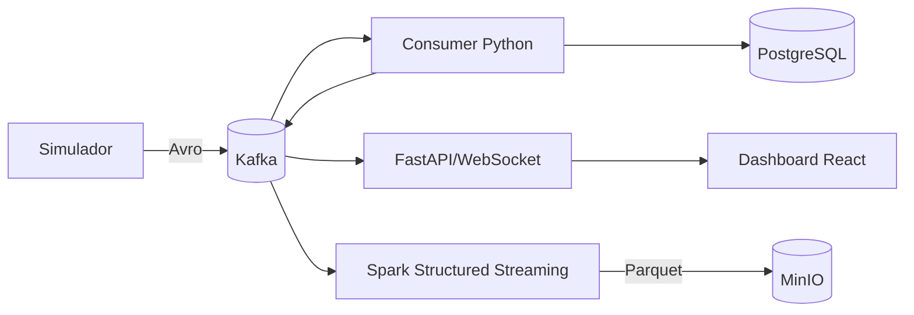

# 🏁 RaceStream Lab

Uma corrida simulada de vinte carros usada como laboratório local de streaming,
arquitetura orientada a eventos e engenharia de dados. O projeto publica eventos
Avro no Kafka, cria projeções operacionais em PostgreSQL, atualiza um dashboard
por WebSocket e arquiva o fluxo em Parquet no MinIO com Apache Spark.


<div align="center">
  
  
  
  
  
  
  
  
  
</div>

## 🧭 Menu

1. [Objetivo](#1-objetivo)
   - [1.1 Problema resolvido](#11-problema-resolvido)
2. [Princípios da arquitetura](#2-princípios-da-arquitetura)
   - [2.1 Tecnologias](#21-tecnologias)
3. [Executar a corrida](#3-executar-a-corrida)
   - [3.1 Iniciar serviços e corrida](#31-iniciar-serviços-e-corrida)
   - [3.2 Finalizar](#32-finalizar)
   - [3.3 Telemetria](#33-telemetria)
4. [Resultados](#4-resultados)
5. [Como analisar](#5-como-analisar)
6. [Como a simulação acontece](#6-como-a-simulação-acontece)
   - [6.1 Configurar](#61-configurar)
7. [Estado da implementação](#7-estado-da-implementação)
8. [Documentação](#8-documentação)

## 1. Objetivo

O RaceStream Lab torna visíveis problemas comuns de sistemas distribuídos:
ordenação por entidade, evolução de contratos, replay, deduplicação, projeções,
recuperação, estado em tempo real e armazenamento histórico. A corrida fornece
eventos frequentes e fáceis de interpretar, como parciais, voltas e pit stops.

### 1.1 Problema resolvido

Uma demonstração estática não mostra o caminho e o ciclo de vida dos dados. Este
projeto oferece uma stack reproduzível em que o mesmo evento alimenta projeções
online, interface WebSocket e arquivo analítico, com contratos e testes que
permitem investigar o comportamento de ponta a ponta.

Consulte a [visão geral técnica](docs/index.md) para o escopo comprovado.

## 2. Princípios da arquitetura

- Eventos Avro desacoplam simulador, consumers, API e arquivador.
- PostgreSQL mantém o estado transacional e as projeções online.
- Kafka transporta eventos com retenção temporária.
- MinIO mantém os objetos Parquet e checkpoints.
- Spark é o único motor de processamento distribuído adotado; o consumer Python
  continua responsável pelas projeções do painel.
- O domínio usa progresso normalizado da pista e não conhece pixels do frontend.



A arquitetura completa está em [docs/architecture.md](docs/architecture.md).

### 2.1 Tecnologias

| Tecnologia | Papel atual |
| --- | --- |
| Python | Física, regras, producer, consumer e API. |
| Kafka + Schema Registry | Transporte e contratos Avro versionados. |
| PostgreSQL | Configuração, corrida, resultados, projeções e outbox. |
| FastAPI + WebSocket | Controle e entrega do estado ao navegador. |
| React + TypeScript + SVG | Mapa, pelotão, telemetria e análises. |
| Spark | Arquivo contínuo e agregações batch. |
| MinIO | Parquet e checkpoints S3A. |
| Docker Compose | Orquestração da stack local. |

## 3. Executar a corrida

### 3.1 Iniciar serviços e corrida

Pré-requisito: Docker com Docker Compose v2.

```bash
cp .env.example .env
docker compose up --build -d
docker compose ps
```

Abra o dashboard, configure a prova e selecione **Iniciar corrida**. O Compose
inicia PostgreSQL, Kafka, Schema Registry, Redpanda Console, MinIO, Spark, API,
dashboard, simulador e consumer.

Os acessos, pré-requisitos e verificações estão em
[docs/getting-started.md](docs/getting-started.md).

### 3.2 Finalizar

Use **Parar corrida** para persistir a classificação parcial. Uma corrida normal
termina após a chegada dos participantes. Para encerrar os serviços preservando
os volumes:

```bash
docker compose down
```

### 3.3 Telemetria

O simulador integra a física em subpassos e publica aproximadamente um snapshot
por segundo real para cada carro. Passagens, voltas, pit stops, incidentes e
controle usam eventos próprios. Os tópicos atuais são:

`telemetry`, `validated`, `timing`, `lap_completed`, `pitstop`, `incident`,
`control`, `state`, `analytics` e `dead_letter`.

Campos, chaves e persistência estão no
[dicionário de dados](docs/dicionario-de-dados.md).

## 4. Resultados

Durante a prova, o dashboard mostra carros no mapa, pelotão ordenado, volta
atual/total, última volta, setup, combustível, pneus e força G estimada. O
acompanhamento por carro, piloto ou equipe apresenta melhor/pior volta, ritmo e
parciais interativas. Na largada, os carros ocupam dez linhas de duas colunas.
Durante a corrida, o pódio recebe destaque verde e abandonos ficam em vermelho
claro; ouro, prata e bronze aparecem somente após o encerramento.

PostgreSQL preserva a configuração, o ciclo da corrida, a classificação final ou
parcial e as projeções recuperáveis. A API ainda não expõe um endpoint dedicado
para listar `race_results`; o dashboard usa a corrida mais recente e as projeções.

## 5. Como analisar

O serviço `spark-archive` arquiva os envelopes Kafka em
`s3a://racestream/telemetry_raw`. O job batch gera `lap_performance` e
`consumer_parity`, comparando contagem, melhor e pior volta com o consumer
online.

Comandos e limites operacionais estão em [docs/spark.md](docs/spark.md). A
persistência está detalhada em [docs/persistence.md](docs/persistence.md).

## 6. Como a simulação acontece

1. A API grava no PostgreSQL a corrida e seus cenários.
2. O producer reserva a largada e carrega carros do PostgreSQL e pista do JSON.
3. `PhysicalRace` atualiza distância, velocidade, combustível, pneus e força G.
4. O producer publica os fatos no Kafka com contratos Avro.
5. O consumer cria voltas, análises e quadros, persistindo-os no PostgreSQL.
6. A API entrega snapshots e eventos pelo WebSocket.
7. Spark arquiva o fluxo no MinIO em paralelo.

Pit stops respeitam 60 km/h da entrada à saída, consomem tempo de serviço e
desaceleram progressivamente até a vaga, podendo alterar a posição. Seus eventos
registram a volta e o tempo cumulativo da passagem pelos boxes. Chuva reduz
aderência/velocidade e agenda trocas para pneus
`wet`. Furos e colisões podem ser programados antes da largada.
Uma colisão aciona safety car até o líder completar a volta seguinte, limita o
pelotão a 120 km/h, bloqueia ultrapassagens e invalida a volta para recordes.

O fluxo completo está em [docs/data-flow.md](docs/data-flow.md).

### 6.1 Configurar

O dashboard permite editar piloto, país, equipe, massa, velocidade, estratégia e
pneu de cada carro. Antes da largada, também permite escolher chuva, intensidade,
volta inicial, furo e colisão. Alterações de setup durante a prova ficam salvas
para a próxima corrida; os participantes da sessão ativa permanecem congelados.

Variáveis e limites estão em [docs/configuration.md](docs/configuration.md).

## 7. Estado da implementação

| Capacidade | Situação |
| --- | --- |
| Simulação, Kafka, Avro, API, WebSocket e dashboard | Implementados. |
| PostgreSQL, Spark e MinIO/Parquet | Implementados. |
| Agregações Spark e comparação com consumer | Implementadas sob demanda. |
| Protobuf, ClickHouse, Iceberg e Debezium | Não implementados. |
| Kubernetes e Helm | Não implementados. |
| OpenTelemetry, Prometheus e Grafana | Não implementados. |
| GitHub Actions/CI/CD | Não implementado. |

Limitações e próximos passos: [docs/limitations.md](docs/limitations.md).

## 8. Documentação

- [Índice técnico](docs/index.md)
- [Serviços e APIs](docs/services-and-apis.md)
- [Instalação e execução](docs/getting-started.md)
- [Desenvolvimento](docs/development.md)
- [Testes](docs/testing.md)
- [Deploy e CI/CD](docs/deployment.md)
- [Logs e observabilidade](docs/observability.md)
- [Troubleshooting](docs/troubleshooting.md)
- [Decisões arquiteturais](docs/decisions.md)
