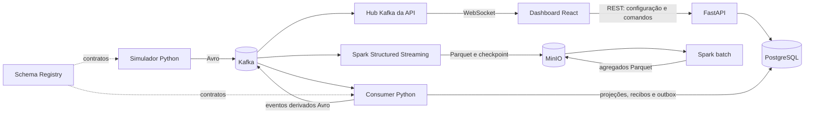
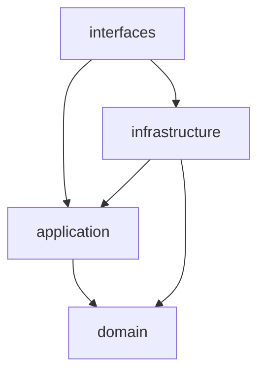

# Arquitetura da solução

## Visão geral

A aplicação separa a geração dos fatos, o transporte, as projeções online, a
apresentação e o arquivo analítico. Kafka é o barramento de eventos; PostgreSQL
é a fonte de verdade operacional; MinIO guarda arquivos; Spark é o motor de
processamento distribuído adotado.



## Componentes principais

| Componente | Implementação | Responsabilidade comprovada |
| --- | --- | --- |
| Simulador | `interfaces/producer.py`, `PhysicalWorker`, `PhysicalRace` | Reserva uma corrida, integra a física, produz snapshots a cada segundo real e fatos de passagem, incidente e pit stop. |
| Transporte | Kafka KRaft local | Mantém dez tópicos com seis partições e retenção de sete dias. |
| Contratos | Avro e Schema Registry | Registra um subject por tópico e aplica compatibilidade `BACKWARD`. |
| Consumer online | `interfaces/stream_processor.py` | Valida eventos fonte, deduplica, atualiza projeções e entrega uma outbox. |
| Persistência operacional | PostgreSQL 16 | Guarda carros, corridas, resultados, sessões, recibos, eventos discretos e outbox. |
| API | FastAPI/Uvicorn | Expõe configurações, controle da prova, consultas e WebSocket. |
| Painel | React 19, TypeScript e SVG | Exibe mapa, pelotão, telemetria, força G, voltas e parciais. |
| Arquivador | Spark Structured Streaming 4.0.1 | Copia envelopes Kafka e metadados para Parquet no MinIO. |
| Análise batch | Spark 4.0.1 | Calcula desempenho por carro e compara com o analytics do consumer. |
| Object storage | MinIO local | Guarda arquivo bruto, checkpoints e saídas analíticas. |

## Limites entre camadas Python

O pacote `racestream` segue, de forma reconhecível, as camadas `domain`,
`application`, `infrastructure` e `interfaces`.



- `domain/` contém modelos, pista e os dois modelos de simulação. O caminho ativo
  do Compose usa `PhysicalRace`; `RaceSimulator` é a implementação anterior
  preservada para serviços/testes legados.
- `application/` contém portas, worker físico, validação e projeções puras.
- `infrastructure/` implementa Kafka, Schema Registry, PostgreSQL e carregamento
  da pista.
- `interfaces/` compõe API, producer, consumer, WebSocket e logging.

O domínio ativo não importa Kafka, FastAPI ou PostgreSQL. Os adapters importam o
domínio e as portas da aplicação.

## Tecnologias e motivo de uso

| Tecnologia | Uso atual | Motivo evidenciado pela implementação |
| --- | --- | --- |
| Python 3.12+ | domínio, serviços e API | Tipagem, testes e bibliotecas de integração. |
| Kafka | barramento de eventos | Ordenação por chave, replay durante a retenção e consumidores desacoplados. |
| Avro | serialização | Contratos versionados e envelopes compactos. |
| Schema Registry | catálogo de schemas | Resolução do schema writer e compatibilidade backward. |
| PostgreSQL | estado operacional | Transações, locks, restrições, JSONB, deduplicação e outbox. |
| FastAPI/WebSocket | interface de aplicação | Comandos HTTP e atualização contínua do painel. |
| React/TypeScript/SVG | interface | Estado tipado, mapa vetorial e interação no navegador. |
| Spark | arquivo e análise | Leitura distribuída do Kafka, Parquet e agregações batch. |
| MinIO/S3A | objetos locais | Persistência de Parquet e checkpoints sem conta de nuvem. |
| Docker Compose | orquestração local | Inicialização reproduzível dos serviços e dependências. |

## Estrutura do projeto

```text
.
├── config/                    definição física aproximada da pista
├── docs/                      documentação, planos, ADRs e evidências
├── frontend/                  dashboard React/TypeScript
├── integrations/             imagem MinIO e integrações locais auxiliares
├── postgres/initdb/           schema e alterações SQL aditivas
├── schemas/                   contratos Avro atuais e históricos
├── scripts/                   automações locais auxiliares
├── src/racestream/            aplicação Python
│   ├── domain/
│   ├── application/
│   ├── infrastructure/
│   └── interfaces/
├── stream-processing/spark/   arquivador e jobs batch Spark
├── tests/                     testes unitários e integração Kafka
├── Dockerfile                 imagem dos serviços Python
├── docker-compose.yml         stack local
└── pyproject.toml             pacote, dependências e ferramentas Python
```

## Tecnologias ausentes

Não há código, dependência, serviço Compose ou manifesto para ClickHouse,
Apache Iceberg, Debezium, Kubernetes, Helm, OpenTelemetry, Prometheus ou Grafana.

> Não identificado no repositório.

Também não há implementação Protobuf. Os contratos executados são Avro.
