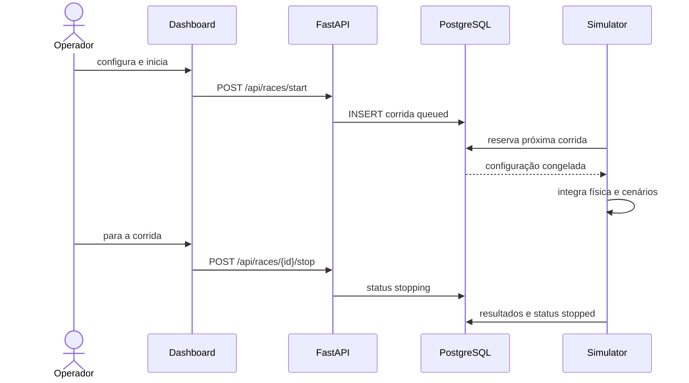
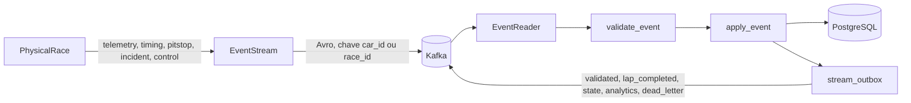
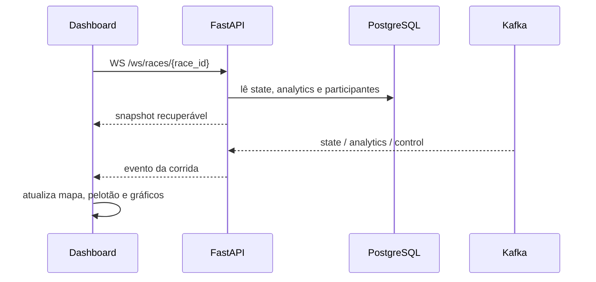
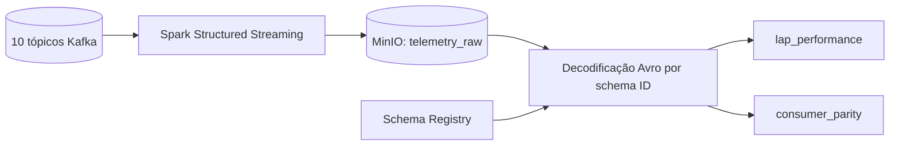

# Fluxo de dados

## Início e término da corrida

O painel envia a configuração de chuva e incidentes para a API. A API valida os
carros e as voltas, grava uma corrida `queued` no PostgreSQL e devolve seu estado.
O producer reserva a próxima corrida com `FOR UPDATE SKIP LOCKED`, muda o estado
para `running` e inicia a simulação. O botão de parada muda o estado para
`stopping`; o worker publica o quadro final e persiste os resultados como
`stopped`. Uma conclusão natural termina como `finished`.

Uma chamada repetida de início enquanto existe corrida controlada ativa retorna
a corrida existente. Ao reiniciar o producer, corridas antes marcadas como
`running` ou `stopping` são encerradas como `stopped`; não existe retomada da
física no ponto interrompido.

## Produção e processamento online

O simulador trabalha com subpassos físicos de 0,02 segundo simulado. A escala
configurável converte tempo real em tempo simulado. O `PhysicalWorker` publica um
snapshot completo aproximadamente a cada segundo real e publica imediatamente
os fatos discretos que surgem entre snapshots.

O consumer ativo assina `telemetry`, `timing`, `pitstop`, `incident` e
`control`. Ele processa até 100 eventos ou 50 ms por lote. O recibo do offset, a
projeção e a outbox são gravados na mesma transação. O offset Kafka é confirmado
depois dessa transação. Replays são tolerados por `stream_receipts`, `event_id` e
uma chave lógica para passagens.

Mensagens inválidas geram um evento no tópico `dead_letter`. O transporte é
configurado para pelo menos uma entrega; o projeto não promete exactly once de
ponta a ponta.

## Atualização do painel

A API mantém uma thread consumidora para `state`, `analytics` e `control`. Cada
conexão WebSocket recebe primeiro o snapshot salvo no PostgreSQL e depois os
eventos Kafka da corrida solicitada. A fila de cada conexão tem limite de 256
eventos e descarta o item mais antigo quando cheia.

O frontend reconecta o WebSocket após um segundo. Quadros `state` completos são
ordenados pela posição. Quadros incompletos podem ser emitidos após três
segundos, mantendo a posição anterior dos carros ausentes e marcando-os como
desatualizados.

## Cronometragem e análises online

A pista define 15 checkpoints, dois finais de setor e a linha de chegada. O
simulador emite `timing` em cada cruzamento. A projeção agrupa os três setores e
a chegada para criar `lap_completed`, mantém melhor/pior/última volta, melhores
setores, até cinco voltas limpas para ritmo e referências comuns de intervalo.
O evento de volta concluída também informa a volta corrente e a posição. Os
eventos de pit stop registram a volta de entrada e o tempo cumulativo da passagem
desde a entrada até a saída do pit lane.

As diferenças ao líder permanecem no contrato `analytics`, mas o painel atual
não exibe a coluna de diferença ao líder no pelotão. Ele exibe a última volta e
permite acompanhar carro, piloto ou equipe. O grid inicial usa duas colunas; o
painel destaca os três primeiros em verde durante a prova, abandonos em vermelho
claro e o pódio final em ouro, prata e bronze.

Uma colisão aciona neutralização automática até o líder completar a volta
seguinte. Nesse período, o simulador limita o pelotão a 120 km/h, impede novas
ultrapassagens em pista e marca as passagens. Uma volta que contenha ao menos uma
passagem neutralizada continua no histórico, mas não participa de recordes e
métricas de ritmo.

Uma penalidade de tempo programada é aplicada na metade da volta escolhida e
publicada em `incident`. Ela aparece na telemetria e no pelotão, mas altera a
ordem apenas na chegada: carros que completaram a mesma distância são ordenados
pelo horário de chegada acrescido da penalidade.

## Arquivamento e análise Spark

O arquivador preserva timestamp, tópico, partição, offset, chave, envelope Avro
e headers. Os arquivos são particionados por tópico e data UTC. O job batch lê
`lap_completed` e `analytics`, calcula contagem/melhor/pior/média por carro e
grava a comparação com a revisão online mais recente.

O Spark não publica as projeções usadas pelo painel e não substitui o consumer
Python no caminho online.
