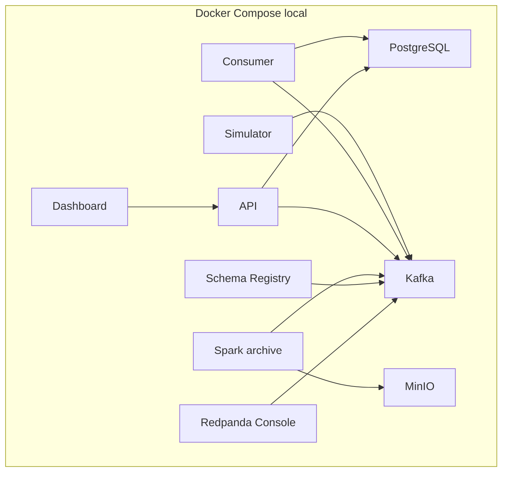

# Deploy e CI/CD

## Alvo implementado

Docker Compose é o único alvo de deploy/orquestração presente. A topologia é de
nó único e voltada ao desenvolvimento local. Os serviços Python compartilham um
Dockerfile; o dashboard e o MinIO têm imagens próprias.

## Health checks e reinício

- PostgreSQL, MinIO, Kafka, Schema Registry e API têm health checks.
- simulator, consumer, API, dashboard e Spark usam `restart: unless-stopped`.
- Redpanda Console também reinicia, mas não tem health check.
- dashboard, simulator, consumer e Spark não têm health checks próprios.
- `topic-init` e `minio-init` devem terminar com sucesso.

## Persistência no deploy local

Os volumes nomeados são `kafka-data`, `postgres-data`, `minio-data` e
`spark-work`. `docker compose down` preserva os volumes; `down -v` os remove.

## Características não adequadas à produção

- Kafka e PostgreSQL têm instância única.
- Kafka usa PLAINTEXT e o Schema Registry usa HTTP.
- Credenciais locais têm valores padrão.
- A API não implementa autenticação ou autorização.
- O dashboard executa o servidor de desenvolvimento Vite.
- Não há proxy reverso, TLS, limites para todos os serviços ou políticas de
  backup.
- Os containers locais da aplicação são construídos no host e não são
  publicados por pipeline.

## Kubernetes e Helm

> Não identificado no repositório.

Não existem manifests, charts, probes Kubernetes, requests/limits de cluster,
ConfigMaps ou Secrets.

## CI/CD

> Não identificado no repositório.

Não existe diretório `.github/`, workflow GitHub Actions ou configuração de
outro provedor de CI. Testes e build são executados manualmente.

## Deploy em nuvem

> Não identificado no repositório.

O uso de S3A aponta para o MinIO local. Não há módulos Terraform, Pulumi,
CloudFormation, Ansible ou configuração de AWS, Azure ou GCP no repositório.

## Unidades systemd auxiliares

`integrations/systemd/` contém automações específicas da estação local. Elas não
fazem parte do deploy dos serviços RaceStream nem são iniciadas pelo Compose.
