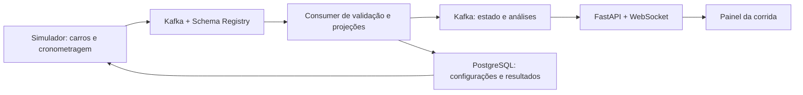

> Implementação de 04/10/2026: este documento preserva a especificação inicial.
> As decisões efetivamente adotadas, incluindo consumo de 218,9 kg/60 voltas,
> geometria aproximada e limites da entrega, estão na
> [ADR 0010](../adr/0010-cronometragem-e-projecoes-de-corrida.md) e no
> [ExecPlan com evidências](../execplan-refinamento-corrida.md).

# Proposta de regras da corrida e do painel — versão 2

Data: 04/10/2026. Estado: proposta para implementação incremental.
Este documento define o comportamento desejado; não descreve funcionalidades
já entregues. As regras atuais continuam válidas até a implementação de cada etapa.

## 1. Objetivo

Simular uma categoria própria de automobilismo, com 20 carros independentes,
cronometragem verificável e uma experiência próxima de um painel de transmissão:
mapa ao vivo, classificação, voltas, parciais e acompanhamento de carro, piloto e
equipe. Todo dado exibido deve ter origem, unidade, instante e qualidade conhecidos.

O laboratório usa referências de corridas reais, mas não declara reproduzir o
regulamento de uma temporada de Fórmula 1. Abastecimento, massas, pneus e estratégias
continuam sendo regras próprias do RaceStream.

## 2. O que preservar e o que revisar

| Item | Regra para a evolução |
| --- | --- |
| Participantes | 10 equipes, 2 carros por equipe, IDs estáveis para carro, piloto e equipe. |
| Categorias | Manter 4 equipes A, 4 B e 2 C e os parâmetros atuais, versionados por regulamento. |
| Estratégias | Preservar A/B/C e a terceira parada de C: abastecer o restante da prova mais uma volta, descontando o combustível a bordo e respeitando o tanque. |
| Controles | Iniciar cria uma prova; parar encerra e salva classificação parcial. Não reiniciar automaticamente. |
| Idioma | Interface, documentação, mensagens e legendas em português do Brasil. |
| Cronometragem | Substituir tempos estimados por tempos de passagem efetivamente calculados na simulação. |
| Movimento | Velocidade, distância e tempo devem obedecer ao mesmo modelo físico. |
| Ultrapassagens | Preservar o limite atual de 12 no modo legado; propor um perfil realista sem teto artificial, dependente de ritmo, tráfego e oportunidades. Não trocar a regra sem registrar a decisão. |
| Pneus | Manter a regra educacional atual identificada como simplificação; um futuro modelo térmico deve substituir, e não disfarçar, o estouro por limiar fixo. |
| Boxes | Evoluir da parada instantânea em qualquer ponto para entrada, percurso, serviço e saída físicos dos boxes. |

## 3. Curvas, setores e pontos de cronometragem

Interlagos tem 4.309 m e 15 curvas; os números no mapa identificam curvas, não
quinze setores oficiais. A apresentação de cronometragem pode combinar três
setores com subdivisões mais detalhadas. Referências: [circuito na F1](https://www.formula1.com/en/information/brazil-autodromo-jose-carlos-pace-sao-paulo.5z2RfrmiTTfEP6Wnxv1yIW),
[15 curvas](https://www.formula1.com/en/latest/article/vital-statistics-the-brazilian-grand-prix.1U0fGOzMn9FPrydFeSfMjV.1U0fGOzMn9FPrydFeSfMjV)
e [três setores e segmentos no Live Timing](https://corp.formula1.com/barcelona-pre-season-testing-as-youve-never-seen-it-before/).

Definição proposta para o laboratório:

- `corner_id`: curva 1 a 15; descreve geometria, raio aproximado, sentido e faixa de velocidade.
- `sector_id`: S1, S2 ou S3, com limites configurados na pista; não dividir automaticamente a pista em três comprimentos iguais.
- `checkpoint_id`: ponto de cronometragem. Proposta inicial: P01 a P15 e a linha de chegada `SF`, com posições normalizadas próprias. É uma instrumentação simulada, não uma declaração sobre sensores oficiais da pista.
- Uma curva pode ter um checkpoint próximo, mas seus IDs não são intercambiáveis. Os limites de setor podem coincidir com checkpoints; caso contrário, são linhas de cronometragem adicionais.
- A definição versionada da pista informa a distância de cada linha, ordem de passagem, setor, entrada/saída de boxes e correspondência com o mapa.
- Coordenadas e curvatura física pertencem à geometria em metros; pixels SVG pertencem exclusivamente ao frontend.

As posições precisas das linhas devem ser mapeadas e verificadas sobre a pista
antes de implementar as parciais. Não inventar posições oficiais nem chamar
marcadores uniformemente espaçados de curvas reais.

## 4. Relógio físico, aceleração e frequência dos eventos

Existem três conceitos distintos:

1. Tempo da simulação: cronômetro físico da corrida, monotônico, usado em voltas, setores, combustível e aceleração.
2. Relógio UTC: quando o evento foi produzido/recebido, para medir latência e investigar falhas.
3. Escala de reprodução: `time_scale=1` para tempo real; maior que 1 para demonstração acelerada.

A frequência pedida é **um snapshot por carro por segundo de relógio real**:
20 carros ativos correspondem a aproximadamente 20 mensagens de telemetria por
segundo, além dos eventos de passagem, boxes, incidentes e controle. Não usar o
intervalo de publicação como passo único da física.

- Integrar a física em passos fixos de tempo simulado, inicialmente 20 ms (50 Hz), configuráveis e testados.
- Publicar telemetria em uma grade de 1 segundo de relógio monotônico, com `snapshot_id` comum; incluir o estado inicial e o terminal fora dessa grade.
- Publicar passagens de linha imediatamente após o cálculo, sem esperar o próximo snapshot. Um passo que cruza várias linhas deve gerar todas as passagens, inclusive em modo acelerado.
- Carro parado nos boxes continua emitindo. Carro abandonado ou finalizado mantém seu estado terminal na classificação; seu heartbeat individual pode cessar depois do evento terminal confirmado.
- Usar `simulation_time_us`, `sample_sequence`, `snapshot_id`, `event_time` e `produced_at` explicitamente. Tempos de corrida não são calculados a partir do horário de chegada ao Kafka.
- O valor G e seus picos devem ser calculados nos subpassos físicos; publicar o valor atual e os picos da janela de 1 segundo. Apenas derivar velocidade entre dois snapshots perderia frenagens e picos.

Proposta de padrão, pendente de preferência de Rafael: demonstração acelerada com
opção de tempo real. O fator 45 pode preservar aproximadamente a experiência
anterior de 60 voltas em dois minutos, mas a duração de parede passa a depender da
prova. Não forçar a chegada para caber em 120 segundos.

## 5. Movimento e cronometragem

### 5.1 Distância e velocidade

O avanço deve vir da velocidade integrada: `ds = v_m_s * dt_simulado`, com
integração adequada quando a velocidade varia. Se tráfego, frenagem ou boxes
limitarem o avanço, velocidade e aceleração reportadas devem refletir o movimento
aceito. Não exibir 300 km/h enquanto a distância avança segundo um tempo de volta
independente dessa velocidade.

Manter distância acumulada sem volta modular, voltas concluídas e `track_progress`
no intervalo `[0, 1)`. Separar posição física no grid de voltas efetivamente
completadas; o espaçamento de largada não concede uma volta parcial gratuita.

### 5.2 Passagens

Cada passagem contém carro/piloto/equipe, volta, linha, setor, instante físico,
velocidade na linha, tempo desde a largada, tempo acumulado da volta e tempo desde
a linha anterior. A unicidade lógica é corrida + carro + volta + linha + tipo.

Interpolar a passagem dentro do subpasso, sem arredondar ao segundo de publicação.
Para movimento linear no subpasso:

`t_passagem = t_anterior + (s_linha - s_anterior) / (s_atual - s_anterior) * dt`

Manter microssegundos no processamento e mostrar milissegundos; essa resolução
não equivale a uma garantia de precisão de um sensor real. Um carro parado não
gera passagem. Repetição do mesmo evento não cria outra parcial.

### 5.3 Voltas e setores

- A primeira volta usa o instante comum da largada como início; as demais começam na passagem pela chegada.
- Uma volta termina apenas ao cruzar `SF`; não usar `track_progress × tempo de referência` como cronômetro.
- Os três setores completos devem somar o tempo da volta, dentro da tolerância numérica definida nos testes.
- Uma volta incompleta não participa de melhor/pior volta. Penalidades não são somadas ao tempo físico da volta; entram na classificação corrigida.
- Preservar todas as voltas completas, com marcas `pit_in`, `pit_out`, neutralização e invalidação, quando existirem.
- Melhor e pior volta gerais: mínimo/máximo das voltas completas e válidas; voltas com boxes continuam visíveis e identificadas.
- Ritmo representativo: estatística separada, inicialmente mediana das últimas cinco voltas limpas e válidas. Excluir boxes, neutralização e largada desse indicador, sem apagar o histórico.
- Melhor parcial pessoal, da equipe e da corrida são comparações do mesmo trecho e da mesma versão de pista.
- Melhor volta teórica = soma dos melhores setores válidos do piloto; rotular como teórica, pois os setores podem vir de voltas diferentes.

Exemplo: passagens P01=5,200 s, P02=9,850 s e P03=14,000 s, desde o início da
volta. O trecho P01→P02 levou 4,650 s, e não 9,850 s. Exibir ambos os conceitos
com rótulos diferentes: **acumulado da volta** e **tempo do trecho**.

## 6. Classificação, intervalos e chegada

A ordem do pelotão é a classificação da corrida, nunca a ordem da última ou da
melhor volta. Um piloto em 15º pode fazer uma volta mais rápida que o 4º e ainda
estar atrás na distância acumulada.

- Fonte autoritativa da classificação ao vivo: controlador central da corrida, que conhece os 20 estados no mesmo instante. Cada carro publica essa posição no snapshot, mas não calcula sozinho a posição dos adversários.
- O consumer valida e consolida essa informação. Entre carros em prova, ordenar por voltas concluídas e distância na volta, com desempate estável; na chegada, usar a ordem e os instantes de cruzamento.
- A tabela vai de P1 até o último; faltas de telemetria não removem carros nem reiniciam suas posições.
- Distinguir `gap_to_leader` de `interval_to_ahead`. O intervalo ao carro da frente pode ser pequeno no fundo do grid; isso não significa menor atraso para o líder.
- Diferenças medidas usam passagens pela mesma linha e mesma volta de referência. Publicar também referência, idade e qualidade da medição.
- Para uma coluna comparável em toda a tabela, usar uma referência comum aos carros comparados. Não misturar passagens de pontos diferentes e apresentar o resultado como um atraso exato e atualizado.
- Se a referência comum estiver desatualizada após uma ultrapassagem, mostrar medição anterior identificada ou `—`; uma estimativa ao vivo, se oferecida, deve estar explicitamente rotulada e usar outro campo.
- Não corrigir inconsistências alterando números artificialmente para que fiquem crescentes. Atualizar a referência e a classificação juntas ou sinalizar a indisponibilidade.
- Retardatários: mostrar `+1 volta`, `+2 voltas` etc., junto de intervalos apenas quando a referência permitir interpretação correta.
- Classificação parcial e classificação final são distintas. Penalidades futuras devem produzir uma classificação corrigida versionada, mantendo o resultado de pista auditável.

Regra de chegada proposta para o laboratório: corrida por distância, inicialmente
60 voltas configuráveis. O líder termina ao completar a distância; os demais
recebem a bandeirada na próxima passagem por `SF`, preservando suas voltas a
menos. Um prazo de encerramento configurável trata carros que não voltam à linha.
Abandono e desclassificação aparecem com estado próprio. A ordenação dos não
finalizados será por voltas completas, distância e último instante válido,
identificada como regra do laboratório, sem alegar equivalência a um regulamento FIA.

O comando **Parar corrida** continua encerrando administrativamente a prova;
não equivale a bandeira vermelha nem a pausa com retomada. Corrida naturalmente
encerrada, interrompida, falha e neutralizada são estados diferentes.

## 7. Arquitetura de eventos

Não introduzir Debezium neste fluxo: o simulador já é a fonte dos eventos.
Debezium é destinado à captura de alterações em bancos e poderá ser avaliado
somente se atualizações externas de cadastros precisarem virar eventos. Referência:
[documentação oficial do Debezium](https://debezium.io/documentation/reference/stable/index.html).

Primeira entrega com consumer Python e transformações testáveis independentes
de infraestrutura. Flink e Spark ficam como implementações futuras dos mesmos
contratos. Não instalar ambos nem introduzir ClickHouse/Iceberg/Kubernetes para
entregar a cronometragem inicial.

### 7.1 Contratos propostos

Envelope comum: `event_id`, `event_type`, `schema_version`, `race_id`, `session_id`,
`track_version`, `rules_version`, `configuration_version`, `simulation_time_us`,
`event_time`, `produced_at`, `source_sequence`. Eventos de carro incluem `car_id`,
`driver_id`, `team_id`. Unidades devem constar no nome ou contrato.

| Evento/tópico lógico | Origem e conteúdo | Chave |
| --- | --- | --- |
| `race.telemetry.raw` | Simulador; 1 Hz por carro: velocidade, posição, distância, volta, progresso, setor, marcha, RPM, acelerador, freio, pneus, combustível e estado. G entra quando o modelo físico estiver validado. | `car_id` |
| `race.timing.crossed` | Cronometragem do simulador; toda passagem por checkpoint, limite de setor e chegada, com instante interpolado. Novo tópico. | `car_id` |
| `race.telemetry.validated` | Consumer; telemetria validada e metadados de qualidade, sem modificar eventos brutos. | `car_id` |
| `race.lap.completed` | Consumer; volta consolidada a partir das passagens, com setores e validade. | `car_id` |
| `race.pitstop` / `race.incident` | Simulador/direção; transições de boxes e fatos da corrida com IDs próprios. | `car_id` quando individual; `race_id` quando coletivo |
| `race.control` | Controlador; configuração congelada da sessão, participantes, largada, interrupção, bandeiras e encerramento. Novo tópico. | `race_id` |
| `race.state` | Consumer; quadro coerente de todos os carros, classificação, estados e referência de tempo. | `race_id` |
| `race.analytics` | Consumer; melhores/piores voltas, parciais, comparações e ritmo por carro/piloto/equipe. | `race_id` para quadro agregado |
| `race.dead-letter` | Validação; erro explícito, origem, motivo e referência ao evento inválido. | Chave original |

Kafka garante ordem dentro de uma partição, não entre tópicos. Correlacionar por
IDs, sequências e tempo de simulação; nunca depender de o evento de controle
chegar antes do snapshot ou de a passagem chegar antes da telemetria.

`race.control` congela os metadados da sessão para replay; mudanças de cadastro
continuam valendo apenas para corridas seguintes. Consumer pode aguardar uma
configuração faltante em buffer limitado e deve registrar falha explícita se ela
não chegar, sem enriquecer uma corrida antiga com o cadastro atual.

### 7.2 Entrega, replay e estado

- Entrega ao menos uma vez; produtor com confirmação e idempotência habilitadas. IDs estáveis são mantidos nas novas tentativas de entrega do mesmo fato.
- Deduplicar por `event_id` e pela chave lógica da passagem. O mesmo evento não altera duas vezes combustível, contagem de voltas ou recordes.
- `poll()` não deve confirmar offset antes do processamento: confirmar somente após salvar a projeção durável e os resultados de saída necessários. O adapter atual confirma logo após desserializar e precisa ser refatorado.
- Para o consumer Python, gravar projeção, IDs processados, offsets e uma outbox dos eventos derivados em transação PostgreSQL. O publicador da outbox envia ao Kafka e marca entrega; destinatários toleram reenvios. Debezium não é necessário para essa outbox inicial.
- Uma janela de replay só pode ser prometida enquanto os eventos e configurações existirem: propor retenção inicial configurável de 7 dias, com limite de disco e alerta. Arquivamento analítico é uma etapa posterior.
- Usar tempo de simulação para cálculos, com uma marca de progresso do controlador e reordenação. Proposta inicial: tolerar 3 segundos de atraso de entrega em relógio real, convertidos pela escala da sessão quando necessário; não confundir com três segundos físicos da prova acelerada.
- Evento além da janela é registrado como tardio e pode gerar revisão versionada da análise; não deve fazer o carro recuar visualmente. Eventos inválidos vão para a fila de erros, não são descartados silenciosamente.
- Carro sem atualização por 3 períodos de publicação recebe `telemetria atrasada`; os demais continuam atualizando. Um único carro sem mensagem não congela o pelotão inteiro.
- Quadros de estado incluem `state_sequence`, instante de referência e qualidade por carro. Rank autoritativo só muda com um quadro consistente; dados individuais podem ficar marcados como antigos.
- API entrega snapshot inicial e fluxo de atualizações com sequência, permitindo reconexão sem perder todo o estado. Definir uma transição atômica snapshot→fluxo ou buffer com deduplicação, evitando a janela entre GET e WebSocket.
- Persistir o último quadro e as análises; após reinício da API ou abertura tardia do navegador, mostrar também provas encerradas. Uma nova prova nunca reaproveita estado da anterior.
- Manter um agregador por corrida nesta fase. Rebalanceamento deve restaurar projeções; múltiplas réplicas da API exigem estratégia de distribuição, pois o mesmo consumer group divide mensagens entre instâncias.

### 7.3 Compatibilidade e migração

Avro continua padrão e Schema Registry mantém compatibilidade retroativa dentro
de cada família de contrato. Protobuf permanece alternativa arquitetural.

Trocar tempos estimados por medidos e redefinir o relógio é mudança de semântica,
não apenas adição de campos. Proposta: família v4 em novos subjects e tópicos físicos
versionados, por exemplo `race.telemetry.raw.v4`, mantendo o tópico v3 para leitura
e replay legado. Os nomes da tabela acima são nomes lógicos, resolvidos por
configuração. Eventos novos começam em v1.

Documentar a migração em ADR antes de implementar: consumer capaz de distinguir
v3/v4, painel com indicação de dados legados, corte entre corridas, rollback por
configuração e nenhuma corrida misturando relógios incompatíveis. Valores ausentes
em eventos legados viram `null`/indisponível, nunca zero ou parcial fabricada.

## 8. Painel e acompanhamento

| Área | Informações e comportamento |
| --- | --- |
| Mapa | Posição física dos 20 carros, balão carro/Pn, seleção, destaque do carro/piloto/equipe, boxes e marcadores opcionais de curvas/setores/checkpoints. |
| Pelotão | Posição, número do carro, nome do piloto, equipe, bandeira, volta, diferença ao líder, intervalo, última volta, pneus, paradas e estado. Colunas secundárias recolhíveis. |
| Carro/piloto | Velocidade, marcha, RPM, acelerador/freio, última/melhor/pior volta, melhor volta teórica, combustível, pneus, parciais atuais e histórico. |
| Equipe | Dois carros lado a lado; comparação do mesmo trecho, volta e condição, estratégias e evolução das diferenças. Não somar tempos de pilotos como se isso definisse classificação de equipe. |
| Parciais | S1/S2/S3 e expansão para P01–P15/SF; tempo do trecho, acumulado, referência pessoal/equipe/corrida e delta. Referência selecionável e explícita. |
| Força G | Indicador lateral/longitudinal, valor atual e picos da janela e da volta, sempre identificado como estimativa do simulador. |
| Direção de prova | Estado da sessão, bandeiras, incidentes, penalidades e motivo de abandono, conforme recursos implementados. |
| Conexão | Idade do dado, atraso/reconexão e indicação de estimado, medido na simulação ou indisponível. |

Cores propostas para parciais: roxo = melhor da sessão, verde = melhor pessoal,
amarelo = sem melhora, cinza = sem medida; incluir texto/ícone, sem depender só
cor. Comparar contra o recorde anterior à nova passagem, registrando empate.

As telas de referência oferecem classificação, mapa, tempos de setores e histórico
de pneus: [F1 Live Timing](https://www.formula1.com/en/timing/f1-live).
Separar diferença ao líder e tempo de setor também preserva o contexto de corrida,
como mostra a [evolução do Live Timing](https://www.formula1.com/en/latest/article/you-speak-we-listen-the-latest-f1-live-timing-improvements.G9HzG04abEZ7wSosVjUfg).

### 8.1 Movimento fluido com dados a cada segundo

Interpolar entre amostras usando um pequeno buffer configurável de apresentação;
FPS de renderização não altera a frequência Kafka. Interpolar distância acumulada,
não diretamente de `track_progress=0,99` para `0,01`, o que faria o carro voltar.
Eventos de passagem podem fornecer âncoras adicionais, especialmente na demonstração
acelerada. Respeitar boxes, chegada, abandono e interrupção; não inventar voltas
quando faltam dados. Ao exceder a janela de extrapolação permitida, congelar somente
o carro afetado e sinalizar a perda. Posição da classificação vem do estado do
backend; a interpolação visual não decide ultrapassagens.

## 9. Força G e realismo físico

É viável mostrar uma estimativa de aceleração em unidades de gravidade, como nos
painéis de automobilismo. A Mercedes descreve cargas longitudinais e laterais e
exemplos acima de 5 g em curvas de F1, mas isso não define um valor fixo para todo
carro ou circuito: [explicação da equipe](https://www.mercedesamgf1.com/news/g-force-and-formula-one-explained).

Modelo proposto, com `g0 = 9,80665 m/s²`:

- Longitudinal: `g_long = (dv/dt_simulado) / g0`; aceleração positiva, frenagem negativa.
- Lateral: `g_lat = v² × curvatura_assinada / g0`, com velocidade em m/s e curvatura em 1/m; definir sinal positivo para a esquerda no contrato.
- Resultante horizontal: `g_horizontal = sqrt(g_long² + g_lat²)`. É horizontal, não a resultante tridimensional incluindo gravidade.
- Publicar `g_longitudinal`, `g_lateral`, `g_horizontal`, pico de aceleração, pico de frenagem e pico lateral no intervalo. Amostras não calculáveis são `null`.
- Não calcular G pela curvatura em pixels do SVG nem pelo tempo acelerado da animação.
- Derivar da velocidade final aceita pela física, com limites coerentes de aderência, frenagem e aceleração. Picos numéricos impossíveis devem gerar erro de validação e revisão do integrador.
- O modelo inicial é plano, sem carga vertical, inclinação ou impacto. Não alegar medir o esforço fisiológico do piloto, sua tolerância ou risco à saúde.

A massa do piloto participa do peso total do carro, mas não é multiplicador
arbitrário da aceleração em g. Valores de desempenho devem ser calibrados para a
categoria própria, sem copiar automaticamente extremos de um F1 moderno.

## 10. Realismo por prioridade

**Primeiro:** relógio coerente, velocidade/distância consistentes, passagens reais,
classificação, chegada, parciais, comparações e dados recuperáveis após reconexão.

**Depois:** trajetória e limite de velocidade dos boxes, tempo de serviço separado
da perda total de tempo, bandeiras, safety car/neutralização, pneus por desgaste e
temperatura, combustível por carga/distância e ultrapassagens baseadas em física.
Ao modelar reabastecimento por vazão, revisar os 3–6 segundos fixos: não representar
qualquer quantidade de combustível como tendo o mesmo tempo de abastecimento.
A estratégia A precisará solicitar a entrada antes de zerar o tanque para alcançar
fisicamente os boxes; essa mudança exige recalibrar e versionar a estratégia.

**Opcional posterior:** chuva, pista molhada, falhas mecânicas, energia híbrida e
regras específicas de uma categoria/temporada. Não incluir rádio real, dados
biométricos ou serviços pagos como requisito do laboratório local.

## 11. Critérios de aceite

1. Cada carro ativo publica velocidade e posição a cada segundo de relógio real; as passagens independem desse intervalo.
2. Uma volta conserva distância e tempo; a integral da velocidade corresponde à distância percorrida dentro da tolerância do integrador.
3. Todas as linhas cruzadas geram exatamente um fato lógico mesmo com publicação, consumo ou replay duplicados.
4. Setores somam a volta; voltas incompletas não viram recorde ou pior volta.
5. Posições do quadro são únicas, ordenadas e pertencem à mesma corrida/instante de classificação. Intervalos e tempos por volta não são confundidos.
6. Selecionar piloto resolve seu carro na sessão; selecionar equipe mostra seus dois carros e comparações válidas.
7. A falta de um carro não paralisa os outros; recarregar o navegador recupera estado e histórico da prova.
8. O teste da terceira parada de C mantém combustível para o restante mais uma volta; o relógio novo não quebra a reserva.
9. Aceleração em reta, curva de raio conhecido e frenagem produzem G analiticamente verificável; `time_scale` não muda os valores físicos.
10. Na referência local de 20 carros/1 Hz, definir e medir latência de transporte p95 até 500 ms, idade do dado ao exibir p95 até 2 s incluindo amostragem/buffer, memória e backlog limitados. São metas de validação, não resultados já obtidos.
